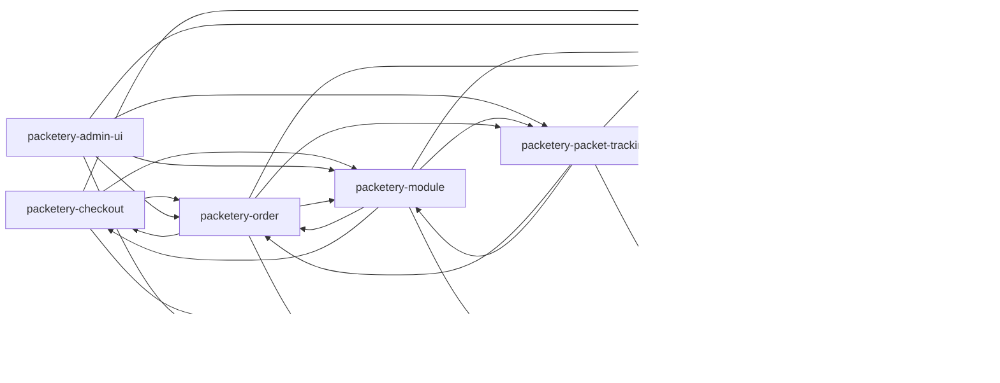

Repo: prestashop · Module: — · Type: architecture · Status: current

## prestashop: module composition

prestashop is built as one PrestaShop module whose slices meet in the module class `Packetery`.
That class is the object PrestaShop instantiates for the hooks; the four admin controllers and the
two front controllers are instantiated by the PrestaShop dispatcher instead
[VERIFY: packetery/controllers/front/cron.php#PacketeryCronModuleFrontController]. The container it
builds registers exactly two factories, for `\Db` and for `\ControllerCore`, and builds anything
else by reflection over the constructor signature
[VERIFY: packetery/libs/DI/ContainerFactory.php#register]. There is no network hop between the
slices — every internal edge is a PHP call resolved through the container or through a direct
`new`.

Textual description of the diagram's links:

calls → packetery-order (sync, in-process)
calls → packetery-carrier (sync, in-process)
calls → packetery-checkout (sync, in-process)
calls → packetery-module (sync, in-process)
calls → packetery-packet-tracking (sync, in-process)
calls → packetery-tools (sync, in-process)

packetery-module sits in the middle. Its hook handlers reach packetery-order on order validation
[VERIFY: packetery/packetery.php#hookActionValidateOrder], packetery-carrier when PrestaShop swaps a
carrier id [VERIFY: packetery/packetery.php#hookActionCarrierUpdate] and packetery-checkout to guard
the delivery step [VERIFY: packetery/libs/Hooks/ActionValidateStepComplete.php#PickupPointValidator],
and its installer creates the table of packetery-packet-tracking
[VERIFY: packetery/libs/Module/Installer.php#PacketTrackingRepository].

packetery-order calls back into packetery-module for the SOAP facade
[VERIFY: packetery/libs/Order/PacketCanceller.php#soapApi], reads the pairing row of
packetery-carrier when it saves an order
[VERIFY: packetery/libs/Order/OrderSaver.php#CarrierRepository], uses the weight calculator of
packetery-checkout for the export [VERIFY: packetery/libs/Order/OrderExporter.php#Calculator] and
reads the status rows of packetery-packet-tracking
[VERIFY: packetery/libs/Order/OrderRepository.php#getOrdersByStateAndLastUpdate].

packetery-checkout reaches packetery-order to persist the chosen pickup point against the cart
[VERIFY: packetery/controllers/front/checkout.php#savePickupPointInCart], packetery-carrier to learn
which vendors the paired carrier allows
[VERIFY: packetery/libs/PickupPointValidate/PickupPointValidator.php#createPickupPointValidateRequest]
and packetery-module for the carrier extra content
[VERIFY: packetery/controllers/front/checkout.php#fetchExtraContent].

packetery-admin-ui renders the grids over the rows packetery-order and packetery-carrier own,
triggers their actions
[VERIFY: packetery/controllers/admin/PacketeryOrderGridController.php#processBulkCreatePacket],
translates the stored packet status of packetery-packet-tracking
[VERIFY: packetery/controllers/admin/PacketeryOrderGridController.php#PacketStatusFactory] and asks
packetery-module for the release check
[VERIFY: packetery/controllers/admin/PacketeryLogGridController.php#VersionChecker].
packetery-packet-tracking drives packetery-order and packetery-carrier from its cron tasks
[VERIFY: packetery/libs/Cron/Tasks/GetConsignPassword.php#execute] and reaches the SOAP facade of
packetery-module [VERIFY: packetery/libs/PacketTracking/PacketTrackingCron.php#SoapApi].

Every slice, packetery-carrier included, reaches packetery-tools for configuration, database access
and logging [VERIFY: packetery/libs/Tools/DbTools.php#execute].

## prestashop: runtime flow pickup point to packet

prestashop turns a cart into a Packeta packet in five steps:

1. The storefront script mounts the Packeta widget under the selected carrier and posts the picked
   point to the front controller `checkout`
   [VERIFY: packetery/views/js/front.js#savePickupPointInCart]
2. The controller writes the point against the cart id in `packetery_order`
   [VERIFY: packetery/libs/Order/OrderSaver.php#savePickupPointInCartGetJson]
3. On order validation the hook handler completes the same row with the order id, the weight and
   the cash-on-delivery flag; the amounts are written later from the admin order detail
   [VERIFY: packetery/libs/Order/OrderSaver.php#saveNewOrder]
4. An employee selects the orders in the Packeta order grid and runs the submit action
   [VERIFY: packetery/controllers/admin/PacketeryOrderGridController.php#processBulkCreatePacket]
5. The submitter builds the packet attributes and calls the Packeta SOAP API, then stores the
   returned packet id as `tracking_number`
   [VERIFY: packetery/libs/Order/PacketSubmitter.php#createPacketSoap]

The flow assumes that the carrier the customer chose is paired with a Packeta service; an unpaired
carrier gets no widget and no row. A fault from the API is collected per order and reported in the
grid, and the orders that failed keep no tracking number
[VERIFY: packetery/libs/Order/PacketSubmitter.php#ordersExport].

## prestashop: runtime flow scheduled tasks

prestashop runs its background work through one public front controller, `cron`, which the shop's
own scheduler must call [VERIFY: packetery/controllers/front/cron.php#display]. The controller
compares the `token` request value with the configuration key `PACKETERY_CRON_TOKEN`, then maps the
`task` value onto one of five task classes and renders the returned message rows
[VERIFY: packetery/controllers/front/cron.php#validateToken].

`cron?task=UpdatePacketStatus` is the task the status feature rests on: it reads the orders that
still have an open packet, asks the Packeta SOAP API for the delivery history of each tracking
number, compares it with the stored rows and writes the difference into `packetery_packet_status`
[VERIFY: packetery/libs/PacketTracking/PacketTrackingCron.php#getPacketTracking]. When the last
status matches a configured mapping, the same run changes the PrestaShop order state
[VERIFY: packetery/libs/PacketTracking/PacketTrackingCron.php#updateOrderStatus].
`cron?task=DownloadCarriers` refreshes the carrier catalogue, `cron?task=GetConsignPassword` fills
the missing consignment codes, `cron?task=DeleteLabels` removes old label PDFs and
`cron?task=PurgeLogs` trims the log table.

## prestashop: authentication and authorisation

prestashop authenticates nothing itself; it leans on the two mechanisms PrestaShop provides and on
one shared secret of its own.

| Boundary | Mechanism | Where | Anchor |
|---|---|---|---|
| employee → admin grids | PrestaShop employee session plus the tab permission attached at install | `packetery/libs/Module/Installer.php` | [VERIFY: packetery/libs/Module/Installer.php#insertMenuItems] |
| storefront → `checkout` | comparison with the front AJAX token PrestaShop issues | `packetery/controllers/front/checkout.php` | [VERIFY: packetery/controllers/front/checkout.php#ajax_front] |
| scheduler → `cron` | shared secret in the `token` request value | `packetery/controllers/front/cron.php` | [VERIFY: packetery/controllers/front/cron.php#validateToken] |
| prestashop → packeta-soap-api | the API password kept in the shop configuration | `packetery/libs/Module/SoapApi.php` | [VERIFY: packetery/libs/Module/SoapApi.php#getApiPass] |

The cron secret is generated at install
[VERIFY: packetery/libs/Module/Installer.php#updateConfiguration] and replaced once, by the 3.0.0
upgrade, which invalidates every cron URL printed before it
[VERIFY: packetery/upgrade/upgrade-3.0.0.php:45]. The module identifies no caller
of the `cron` route beyond that secret, so any client that holds it can run every task.

## prestashop: data and persistence

prestashop stores everything in the shop's own MySQL database, in tables it creates at install and
drops at uninstall [VERIFY: packetery/libs/Module/Installer.php#installDatabase]. The module owns
five tables: `packetery_order` and `packetery_payment` belong to packetery-order,
`packetery_address_delivery` to packetery-carrier, `packetery_product_attribute` to
packetery-module and `packetery_log` to packetery-tools. Two further tables hold copies of Packeta
data rather than a source of truth — `packetery_carriers` mirrors the carrier feed and
`packetery_packet_status` mirrors the delivery history of a packet
[VERIFY: packetery/libs/PacketTracking/PacketTrackingRepository.php#getCreateTableSql].

calls → mysql (sync, SQL)

Every statement goes through the wrapper `DbTools`, which turns a failed query into a
`DatabaseException` instead of a silent `false` [VERIFY: packetery/libs/Tools/DbTools.php:66].
The schema has no migration framework: `packetery/upgrade/` holds 14 `upgrade_module_*` functions,
fewer than the released versions, and the 8 of them that change the schema run their `ALTER TABLE`
statements themselves
[VERIFY: packetery/upgrade/upgrade-3.4.0.php#upgrade_module_3_4_0]. Uninstall renames
`packetery_order` to a backup table instead of dropping it
[VERIFY: packetery/libs/Module/Uninstaller.php:117].

## prestashop: cross-cutting mechanisms

prestashop applies three mechanisms across its modules. The first is the PrestaShop hook system,
which carries every in-process event the module reacts to; those hooks have no channel and are not
manifest entries. The module registers 20 hooks in any one installation — 19 fixed names plus one of two that branch
on the PrestaShop version
[VERIFY: packetery/packetery.php#getModuleHooksList]: the storefront family
(`displayBeforeCarrier`, `displayCarrierExtraContent`, `displayHeader`, `actionCarrierProcess`,
`actionValidateStepComplete`) mounts and guards the widget, the order family
(`actionValidateOrder`, `actionObjectOrderUpdateBefore`, `actionObjectCartUpdateBefore`,
`displayOrderConfirmation`, `displayOrderDetail`, `sendMailAlterTemplateVars`) keeps the
`packetery_order` row and the customer-facing texts in step, and the back-office family
(`displayAdminOrderMain`, `actionAdminControllerSetMedia`, `displayAdminProductsExtra`,
`actionProductUpdate`, `actionProductDelete`) renders the Packeta panels. Three of the hook names
belong to this repository's own grids, but the repository only registers and handles them — no
`Hook::exec` call exists anywhere under `packetery/`
[VERIFY: packetery/packetery.php#hookActionPacketeryOrderGridListingResultsModifier].

| Mechanism | Scope | Anchor |
|---|---|---|
| PrestaShop hooks as in-process events | 20 registered hooks | [VERIFY: packetery/packetery.php#getModuleHooksList] |
| container lookup by class name | every service of every module | [VERIFY: packetery/libs/DI/Container.php#ReflectionClass] |
| API call logging | the SOAP calls and the widget validation call, not the carrier feed or the version check | [VERIFY: packetery/libs/Log/LogRepository.php#insertRow] |

The container is a hand-written map with two registered factories and a fallback that builds any
other class by reflection, so a service is asked for by its class name and never by a string id
[VERIFY: packetery/libs/DI/Container.php#register].

> ⚠ add business context (elicitation)
