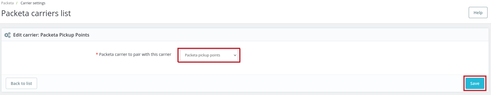

### Nastavení dopravců
Dopravce vytvoříte v menu *Doručení* - *Dopravci*.
Postup konfigurace dopravců je popsán v oficiální dokumentaci PrestaShopu [https://doc.prestashop.com/display/PS17/Carriers](https://doc.prestashop.com/display/PS17/Carriers).

#### Nastavení dopravců Zásilkovny

V menu vyberte *Zásilkovna* - *Nastavení dopravců*.

Zobrazí se seznam všech dopravců, které máte v obchodě vytvořené. 
Je potřeba vytvořeného dopravce napárovat s dopravcem Zásilkovny. Klikněte na tlačítko se symbolem tužky a zobrazí se stránka **Upravit dopravce**.

**Dopravce Zásilkovny pro spárování s tímto dopravcem** - v roletce se zobrazí seznam všech dopravců Zásilkovny, kteří doručují do zemí zóny, kterou jste vybrali u dopravce.
Vybraného dopravce napárujete pomocí tlačítka **Uložit**.

V závislosti na tom, jakého jste vybrali dopravce, se zobrazí další nastavení.

Nastavení pro dopravce **Zásilkovna - výdejní místa (Packeta pickup points)**

Pokud jste vybrali HD (Home Delivery) dopravce, tzn. dopravce který doručuje na adresu,

zobrazí se volby, zda pro ověření adresy použít v pokladně widget Zásilkovny.

- Při volbě **Ne** se adresa v pokladně pomocí widgetu neověřuje a zákazník může zadat libovolnou adresu.
- Volbou **Ano** se adresa zadaná zákazníkem musí v pokladně ověřit pomocí widgetu Zásilkovny, bez ověření adresy nebude možné objednávku dokončit.
- Možnost **Volitelně** způsobí, že se widget v pokladně zobrazí, ale není nutné jej pro ověření adresy použít.

Ověřování adresy widgetem Zásilkovny je možné pouze pro Českou a Slovenskou republiku.

Tato další nastavení je potřeba uložit pomocí tlačítka **Uložit**.

##### Aktualizace dopravců Zásilkovny
V této sekci je možné ručně aktualizovat seznam dopravců Zásilkovny pomocí tlačítka.
Aktualizace není možná, pokud jste nevyplnili API heslo v [konfiguraci modulu](configuration.md).

[&larr; Konfigurace](configuration.md) | [Objednávky &rarr;](orders.md)
