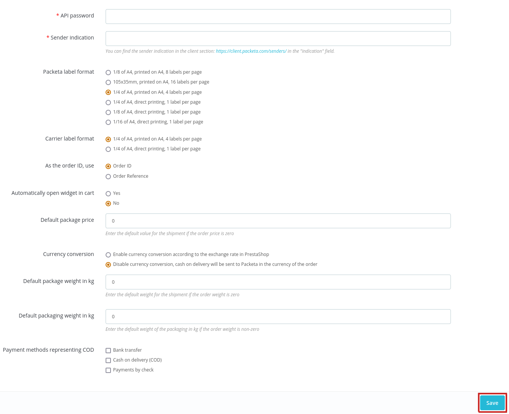

### Konfigurace

Po úspěšné instalaci klikněte na tlačítko **Konfigurovat** nebo v hlavním menu Zásilkovna -> Konfigurace. 

#### Nastavení modulu

V případě, že nemáte uživatelský účet na stránkách Zásilkovny, je možné v rámci testování funkcionality modulu či podávání zásilek požádat o testovací účet na emailu Zákaznického servisu: [e-commerce.support@packeta.com](mailto:e-commerce.support@packeta.com):

- **API heslo**  - vaše API heslo naleznete v [klientské sekci Zásilkovny](https://client.packeta.com/support/) v části **Klientská podpora**

- **Označení odesílatele** - označení odesílatele které máte nastaveno v [klientské sekci](https://client.packeta.com/senders/) v seznamu odesílatelů

Tyto dva údaje jsou povinné a klíčové pro správné fungování modulu a komunikaci mezi vaším e-shopem a Zásilkovnou.

- **Formát štítku Zásilkovny** - vyberte formát štítku, který chcete používat
- **Formát štítku dopravce** - vyberte formát štítku, který chcete používat
- **Jako číslo objednávky u zásilek uvádět** - vyberte, zda se má při exportu použít id nebo kód objednávky jako číslo objednávky
- **Automatické otevření widgetu v košíku** - pokud je zaškrtnuto, widget pro výběr výdejního místa se v košíku automaticky otevře 
- **Výchozí hodnota zásilky** - zadejte výchozí hodnotu zásilky, pokud je cena objednávky nulová
- **Převod měn** - vyberte, zda chcete převádět ceny pomocí konverze měn PrestaShopu nebo zda budete odesílat do Zásilkovny hodnotu dobírky v měně objednávky 
- **Výchozí hmotnost balíku v kg** - zadejte výchozí hmotnost zásilky, pokud je hmotnost zboží objednávky nula
- **Výchozí hmotnost obalového materiálu v kg** - zadejte výchozí hmotnost obalového materiálu v kg, pokud není hmotnost zboží objednávky nulová, bude tato hodnota přičtena k hmotnosti zboží
- **Platební metody reprezentující dobírku** - z výběru platebních metod vyberte ty, které představují platbu na dobírku

Změněná nastavení je potřeba uložit kliknutím na tlačítko **Uložit**.

[&#8592;  Instalace](installation.md) | [Konfigurace dopravců &#8594;](carriersConfiguration.md) 
