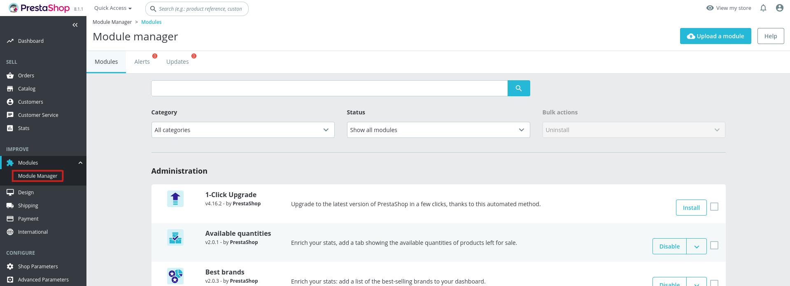

### Instalace
1. Přihlašte se do administrace PrestaShopu, klikněte na záložku "Moduly -> Module Manager".:

2. V pravém horním rohu stránky klikněte na "Nahrát modul":

3. Klikněte na "vybrat soubor" a najděte cestu ke staženému souboru modulu, případně přetáhněte stažený soubor modulu pomocí myši do oblasti vyznačené přerušovanou čárou:

[Konfigurace modulu &#8594;](configuration.md) 
